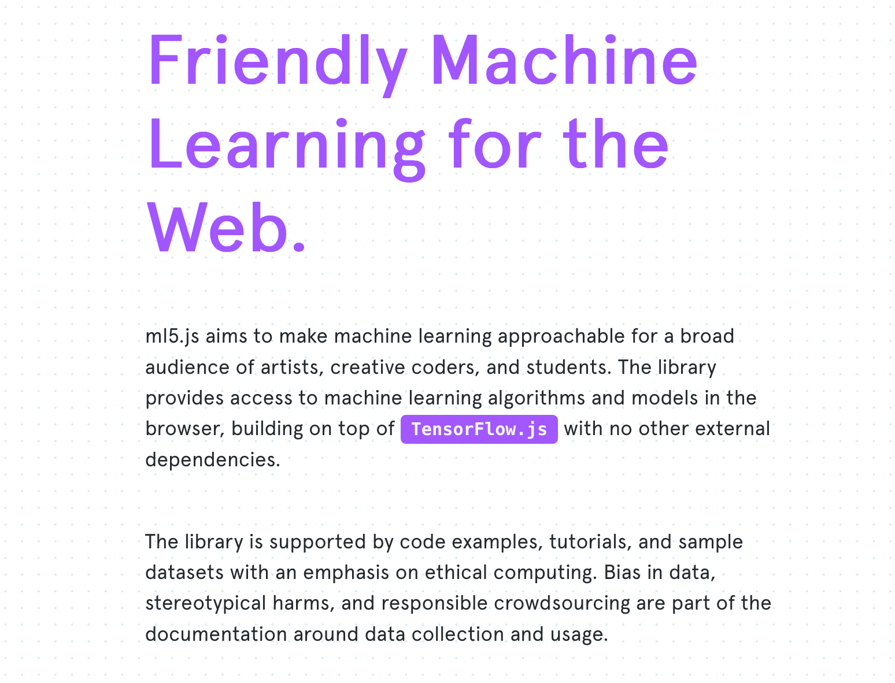

# How to Contribute
> Welcome to the ml5 project! Developing ml5 is not just about developing machine learning software, it is about making machine learning approachable for a broad audience of artists, creative coders, and students. The library provides access to machine learning algorithms and models in the browser, building on top of TensorFlow.js with no other external dependencies. The library is supported by code examples, tutorials, and sample datasets with an emphasis on ethical computing. Bias in data, stereotypical harms, and responsible crowdsourcing are part of the documentation around data collection and usage. We're building **friendly** machine learning for the web - we're glad you're here!



## The ml5 ecosystem (last updated: 22, March 2019)

ml5.js is comprised a number of sister repositories which you can find at the [ml5 github organization - github.com/ml5js](https://github.com/ml5js). As a contributor of ml5 you should be aware of the other parallel repositories of the ml5 project.

- **The 3 main repositories you'll likely be working with**:
  + [ml5-library]([https://github.com/ml5js](https://github.com/ml5js/ml5-library))
    * this is the main ml5js library. When building the library, all of the files in the `/src` directory get bundled into the `ml5.js` library. Releases to the ml5 library get sent to `npm` and are hosted at https://unpkg.com/ (e.g. `https://unpkg.com/ml5@0.2.1/dist/ml5.min.js`)
  + [ml5-examples](https://github.com/ml5js/ml5-examples)
    * the ml5-examples repo showcases the functionality of the ml5-library. When submitting new features or updates to the ml5 library, you should also make a pull request to the ml5-examples repo to showcase how your new feature works. Usually examples are submitted in a simple p5.js sketch, but they can also be in vanilla javascript.
  + [ml5-website](https://github.com/ml5js/ml5-website)
    * the ml5-website is what you see here: https://ml5js.org/. As we make changes to the ml5 API and examples, the website also needs to be updated. For now, we're working with a manual process to updating changes, but we're working on development processes to help sync all these efforts. For now, make sure to update the ml5-examples and ml5-website when making changes to ml5-library and vice-versa.
- **Data and models**:
  + [ml5-data-and-models](https://github.com/ml5js/ml5-data-and-models)
    * This repository stores data sets and pre-trained models you can use in ml5.js.
  + [pix2pix_models](https://github.com/ml5js/pix2pix_models):
    * A collection of pix2pix models
+ **Training your own models**:
  + [training-lstm](https://github.com/ml5js/training-lstm)
    * Multi-layer Recurrent Neural Networks (LSTM, RNN) for character-level language models in Python using Tensorflow and modified to work with tensorflow.js and ml5js
  + [training-word2vec](https://github.com/ml5js/training-word2vec)
    * How to train your own word2vec model for use with ml5.js
  + [training-styletransfer](https://github.com/ml5js/training-styletransfer)
    * This repository contains a slightly modified version of Fast Style Transfer in TensorFlow. It trains a neural network on the style of any image you provide it and outputs a model you can use in ml5.js with the ml5.styleTransfer() method.
  + [training-pix2pix](https://github.com/ml5js/training-pix2pix)
    *  documentation coming soon

## Contributing Workflow

Preamble: If you're interested in to contribute to the ml5 project, just know you can always open an issue to ask questions or flag things that may seem confusing, unclear or intimidating. Our goal is to make ml5 as open and supportive as possible for those who want to be involved. Ok, now that's out of the way, here's how a general workflow for what contributions might look like to ml5.

### For bug fixes
1. you read the CONTRIBUTING.md docs ❤️
2. you take a peek at the [issues](https://github.com/ml5js/ml5-library/issues) and identify one you'd like to address OR you file an issue about a bug you discovered. 🐛
3. you make a comment on an existing issue or post your issue and indicate that you're curious to do your best to solve it 🔬
4. you create a new branch on your `forked` copy of the ml5-library and call it something meaningful like `fix-detection-results`
5. you jam on fixing the bug, commit your changes with meaningful commit messages, and push your changes to your bug fix branch (e.g. `fix-detection-results`)
6. when ready, make a pull request to the `release` branch or `development` branch of ml5-library. Submit to the `release` branch if the bug you found was in the current ml5 release - the version of ml5 which is on npm. Submit to the `development` branch if the bug you found was in `developmpent` branch of ml5-library.
7. the ml5 dev team will review your changes and quite likely correspond with you on your changes. When all looks good, your changes will be merged in. 🎉
8. hi-fives 👏 and hugs 🤗

### For new features or feature additions/updates
1. you read the CONTRIBUTING.md docs ❤️
2. you take a peek at the [issues](https://github.com/ml5js/ml5-library/issues) and identify one you'd like to address OR you file an issue about the feature you're looking to add or update. 🐛
3. you make a comment on an existing issue or post your issue and indicate that you're curious to do your best to add this to ml5-library 🔬
4. you create a new branch on your `forked` copy of the ml5-library and call it something meaningful like `new-generative-model-x`
5. you jam on your new feature, commit your changes with meaningful commit messages, and push your changes to your new feature branch (e.g. `new-generative-model-x`)
6. when ready, make a pull request to the `development` branch of ml5-library. Submit to the `development` since your feature is part of the new frontier of the ml5-library. Important is step 7 below.
7. you should also submit a pull request to ml5-examples with an example of your new feature so the ml5 dev team can run your proposed feature and provide feedback.
8. the ml5 dev team will review your changes and quite likely correspond with you on your changes. When all looks good, your changes will be merged in. 🎉
9. hi-fives 👏 and hugs 🤗

**Now that you have a general impression for what this process might look like, you can get started!**

## Getting Started

If you want to help develop this library, here are the steps to get started:


### Setup

We use node.js as our development environment for bundling code, running tests, and more. If you've never used node.js before, here's the steps to get node up and running on your machine. Installation requirements differ according to your computer's operating system. Please refer to the correct setup section for your specific environment

- [windows]()
- [macOS]()

#### For Windows Users
* Install node.js Version 10: https://nodejs.org/en/download/

#### For macOS Users

For mac users, we recommend installing nodejs through homebrew which is a package manager. Even further, we recommend installing nodejs using nvm which is a node version manager so that you can install different versions of nodejs and switch between them. You can skip all that and use install nodejs - https://nodejs.org/en/download/ - but we do recommend using homebrew, etc.

This is how you can do this:

**Install [homebrew](https://brew.sh/)**

Open up your terminal and paste + enter:
```sh
/usr/bin/ruby -e "$(curl -fsSL https://raw.githubusercontent.com/Homebrew/install/master/install)"
```

Next use homebrew to **install nvm and node** using the `brew` command (ref: https://www.wdiaz.org/how-to-install-nvm-with-homebrew/):

```sh
brew install nvm
mkdir ~/.nvm
nvm install node
nvm install 10.15
nvm use 10

nvm run node --version
```

NOTE: you may need to add the reference to nvm and node into your `bash_profile` in which case you can paste the following into the `~/.bash_profile` or `~/.zshenv` file if you are using ZSH, or in `~/.bashrc` for BASH or `~/.zshrc` for ZSH ref: https://www.wdiaz.org/how-to-install-nvm-with-homebrew/):

```sh
export NVM_DIR="$HOME/.nvm"
NVM_HOMEBREW="/usr/local/opt/nvm/nvm.sh"
[ -s "$NVM_HOMEBREW" ] && \. "$NVM_HOMEBREW"
```

### Developing ml5

1. Fork the repository to your account, and then clone it your computer:
   ```bash
   git clone https://github.com/YOURGITHUBHANDLE/ml5-library.git
   ```

2. Install dependencies:

   ```bash
   cd ml5-library
   npm install
   ```

3. This project is developed using [Webpack](https://webpack.js.org/). Webpack is a module bundler that "bundles" different files into one file. This file is usually called a library.

  Under the `/src` folder there are sub-folders for all `ml5` methods. Before building the library, you can check to see everything is working:

  - Run this command from the root of the project:
    ```bash
    npm run start
    ```

    That should output something similar to this:

    ```bash
    Project is running at http://localhost:8080/
    webpack output is served from /

    Hash: 16b80528bf532975b279
    Version: webpack 2.6.1
    Time: 4905ms
      Asset     Size  Chunks                    Chunk Names
    ml5.js  1.55 MB       0  [emitted]  [big]  main
    chunk    {0} ml5.js (main) 1.5 MB [entry] [rendered]
        [9] (webpack)/buildin/global.js 509 bytes {0} [built]
      [191] ./src/index.js 403 bytes {0} [built]
      [192] ./~/babel-polyfill/lib/index.js 833 bytes {0} [built]
      [193] (webpack)-dev-server/client?http://localhost:8080 5.68 kB {0} [built]
      [196] ./src/ImageNet/index.js 5.63 kB {0} [built]
      [198] ./src/Lstm/index.js 7.7 kB {0} [built]
      [200] ./src/NeuralNetwork/index.js 6.8 kB {0} [built]
      [204] ./~/babel-polyfill/~/regenerator-runtime/runtime.js 24.4 kB {0} [built]
      [404] ./~/core-js/shim.js 8.18 kB {0} [built]
      [507] ./~/strip-ansi/index.js 161 bytes {0} [built]
      [509] ./~/url/url.js 23.3 kB {0} [built]
      [511] (webpack)-dev-server/client/overlay.js 3.73 kB {0} [built]
      [512] (webpack)-dev-server/client/socket.js 897 bytes {0} [built]
      [513] (webpack)/hot/emitter.js 77 bytes {0} [built]
      [515] multi (webpack)-dev-server/client?http://localhost:8080 babel-polyfill ./src/index.js 52 bytes {0} [built]
        + 501 hidden modules
    webpack: Compiled successfully.
    ```
    
    

    If you see this message, it means the project is actively being built by Webpack's `webpack-dev-server`. Any changes you make to any file in the `/src` folder will automatically rebuild the `ml5.js` and `ml5.min.js` libraries as long as the server continues to run.

4. Develop!

  Run this command from the root of the project:

  ```bash
  npm run manual-test
  ```

  This creates a new folder called `/manual-test` in the project's root folder. Create an `index.html` file inside `/manual-test` and add the following:

  ```html
  <!DOCTYPE html>
  <html>
  <head>
    <title>Test</title>
    <script src="http://localhost:8080/ml5.js"></script>
  </head>
  <body>

    <script>

    </script>

  </body>
  </html>
  ```

  This is just a simple `html` file that has a reference to the `ml5` library.

  Next, open the `/src/index.js` file and add this after the last line:

  ```js
  console.log('Hello Test Development!');
  ```

  If you now go to `http://localhost:8080/` and open the console, you should see `Hello Test Development!`. As you make changes, you will simply need to reload the `index.html` page to see them.

5. Once you have finished testing, you can build the library. Just close the `webpack-dev-server` and run

  ```bash
  npm run build
  ```

  That should output something very similar to the `webpack-dev-server` from step 3 but you'll notice at the end is this line:

  ```bash
  > webpack --config webpack.prod.babel.js
  > Done in 15.13s.
  ```

  If you see this, it means the library was successfully built and minified.


6. (OPTIONAL) Commit your changes. We are using [Commitizen](https://github.com/commitizen/cz-cli) to commit changes. Commitizen is a tool that allows you to specify commits in a more precise way. You can run it instead of your regular `git commit -m 'msg'` with:

  ```bash
  npm run commit
  ```

  That will show you an interactive prompt to commit:
  ```bash
  ? Select the type of change that you're committing: (Use arrow keys)
  ❯ feat:     A new feature
    fix:      A bug fix
    docs:     Documentation only changes
    style:    Changes that do not affect the meaning of the code (white-space, formatting, missing semi-colons, etc)
    refactor: A code change that neither fixes a bug nor adds a feature
    perf:     A code change that improves performance
    test:     Adding missing tests or correcting existing tests
  ```

  Just be sure to add files before running commitizen!

7. (OPTIONAL) Push your code and submit a Pull Request! Remember if you make a pull request on a new features or feature update you should make a parallel pull request to the ml5-examples repo so that others can use your new feature and test it out.

## Running Unit Tests


We’re still rolling out all of our unit tests, but if you want to contribute to their development or just test with the models that have more robust unit tests in place:

 - To run all tests continuously as you update
   ```npm run test```

 - To run all tests once
   ```npm run test:single```

 - To run a test on a single model
   ```npm run test -- --model=YourModelNameHere```

This last one is case sensitive!


## Making Releases (For the ml5 core team)

Work in progress - we are working on making a few scripts to make it easier to make releases and deployments. For now, to address the long-winded process noted in https://github.com/ml5js/ml5-library/issues/387, we are experimenting with some devOps scripts.

In the instance you're ready to make a new release from `development` to `release`:

Steps:

1. change the version number and checkout a new branch:

```
newversion=0.3.2 npm run release:prep
```

you'll be now in: `v0.3.2`

2. update the readme

```
pversion=0.3.1 npm run update:readme
```

3. Run install & build

```
npm run release:build
```

4. Add and commit and push changes

```
npm run release:commitAndPush
```

5. Add tags and push

```
npm run release:tag
```

Go to Github and wait for tests to pass, then `squash and merge` the newly created `v0.3.2` branch to `development`;

6. Go back to your terminal:

  ```
  npm run development:sync
  ```

7. Now go back to github and make a PR from `development` to `release`, wait for tests to pass, then `squash and merge` `development` into `release`

8. Go back to your terminal:

  ```
  npm run release:sync
  ```


9. publish to npm

```
npm run publish:npm
```

7. Enter your multi-factor auth when prompted where it says `OTP` (one time password): `your OTP code`
8. Your new npm version should be released!

Now what is important is that you:

1. go to Github and document that new release with `release notes`.
2. go to `ml5-examples` and make sure you have the latest development branch stuff:

  ```
  git checkout development
  git fetch
  git pull
  ```

3. then make a new branch for deployment e.g. `new-release-v0.3.2` and update the ml5 references on all examples:

  ```
  git checkout -b new-release-v0.3.2
  npm run update-ml5 0.3.2
  git add .
  git commit -m "update examples to v0.3.2"
  ```

4. Fix any merge conflicts if necessary

  ```
  git push origin new-release-v0.3.2
  git tag v0.3.2
  git push --tags
  ```

5. Merge `new-release-v0.3.2` with `release`
6. Add release notes to the latest release
7. Merge `release` with `master` (for the github pages & website)


## Additional Resources

- [How to Contribute to an Open Source Project on GitHub](https://egghead.io/courses/how-to-contribute-to-an-open-source-project-on-github)
- [How to Write an Open Source JavaScript Library](https://egghead.io/courses/how-to-write-an-open-source-javascript-library)
